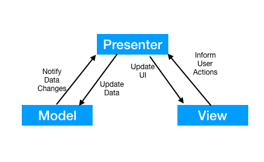
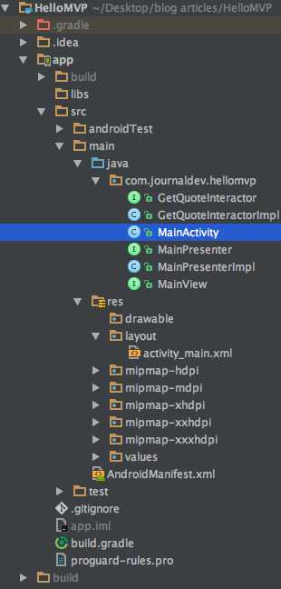
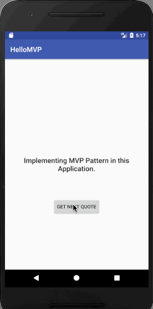

Kotlin MVP 2
=========================
the android MVP principles and develop an application based on it. Since the start, we’ve been developing applications
by adding all the business logic inside the Activity. Let’s analyze the cons of our current approach before digging into
the new principles.    

Android MVP
========================
With our current approach, the MainActivity class contains all the implementation logic of our application. We’ve been using stuff ranging from Retrofit callbacks to data models(SharedPref, POJO classes) all inside the Activity class.
Eventually, our Activities become god classes and cause problems in maintainability, readability, scalability and refactoring an already bloated code.

Unit testing gets tough since the implementation logic is tightly coupled with the Android APIs. This is where MVP ( Model View Presenter) comes in handy. It allows us to write a clean and flexible code base while giving the luxury to switch any part of the code without much hassle.

Model View Presenter
Model View Presenter divides our application into three layers namely the Model, View and Presenter.

**Model**: This handles the data part of our application  
**Presenter**: It acts as a bridge that connects a Model and a View.  
**View**: This is responsible for laying out views with the relevant data as instructed by the Presenter.  

          

GIF:
================

